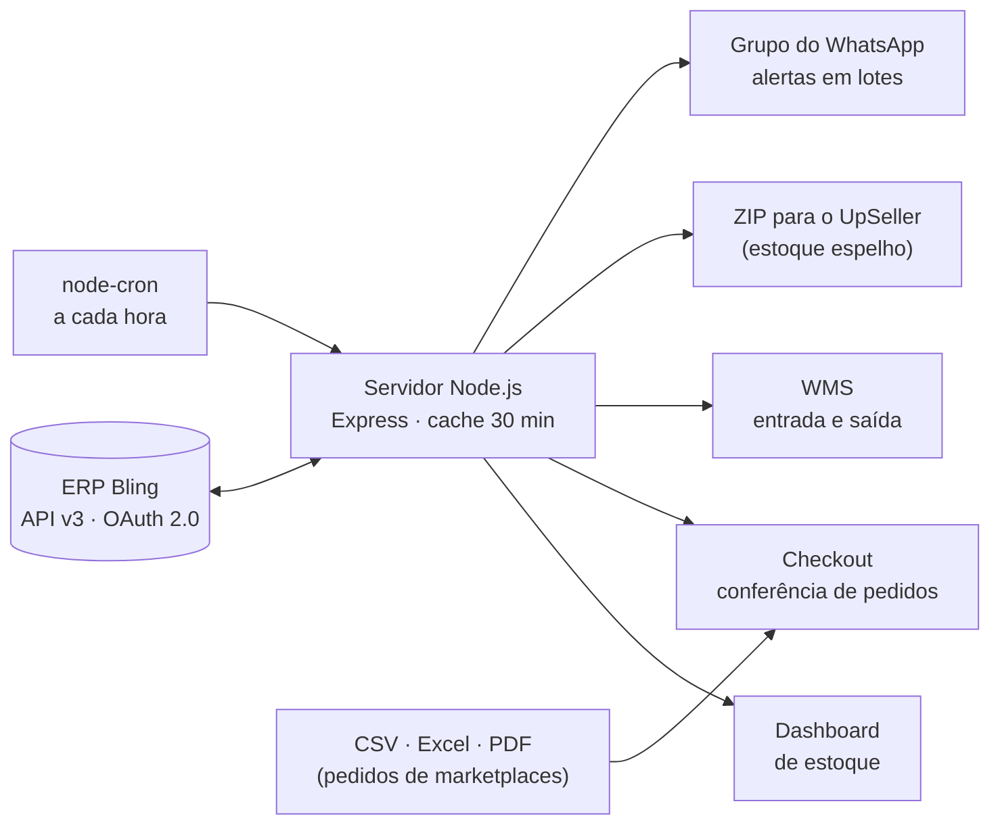

# 📦 WMS de Estoque com Bling + Alertas no WhatsApp

### Gestão de estoque, conferência de pedidos e alertas automáticos para uma loja de moda omnichannel

[](https://github.com/diaquinodev/wms-bling/actions/workflows/ci.yml)
[](package.json)
[](index.js)
[](https://developer.bling.com.br/)
[](https://wwebjs.dev/)

---

## 📌 O problema

Uma loja de moda que vende no site próprio e em marketplaces controlava o estoque pelo ERP **Bling**, mas a operação sofria com:

- **Ruptura silenciosa:** produtos zeravam sem ninguém perceber, e o anúncio continuava ativo nos marketplaces.
- **Conferência manual de pedidos:** separação feita no olho, com erro de item e de baixa de estoque.
- **Planilhas de estoque para o hub de marketplaces (UpSeller)** montadas à mão.

## 💡 A solução

Um servidor **Node.js** local que integra o Bling, expõe três painéis web para a operação e roda um **robô de alertas** que avisa o time no WhatsApp.



## ⚙️ Funcionalidades

| Módulo | O que faz |
| :--- | :--- |
| **Autenticação Bling** | Fluxo OAuth 2.0 (*authorization code*) com **renovação automática** do `access_token` via `refresh_token`. |
| **Dashboard de estoque** (`dashboard.html`) | Catálogo completo paginado da API (100 itens por página), com **cache de 30 min** para não estourar o limite de requisições. |
| **Checkout** (`checkout.html`) | Sincroniza pedidos dos últimos 60 dias, importa pedidos de marketplaces por **CSV, Excel ou PDF** (romaneio) e dá **baixa no estoque** ao finalizar a conferência. |
| **WMS** (`wms.html`) | Busca produto por código e registra **entrada ou saída** no depósito do Bling. |
| **Exportação UpSeller** | Gera um **ZIP** com a planilha de estoque espelho no layout do UpSeller, com margem configurável (`?base=`) e relatório de exportação. |
| **Robô de alertas** | A cada hora, identifica produtos **zerados ou com estoque baixo** (0 a 10 un.), ignora referências fora de linha e envia ao grupo do WhatsApp **em lotes de 20, com pausa de 2 min** entre eles para não travar o grupo. |

### Endpoints

| Método | Rota | Uso |
| :--- | :--- | :--- |
| `GET` | `/api/produtos` | Catálogo com saldo (com cache) |
| `GET` | `/api/disparar-alerta` | Dispara o robô de alertas manualmente |
| `GET` | `/api/exportar-upseller?base=2000` | ZIP de estoque para o UpSeller |
| `GET` | `/api/checkout/sincronizar` | Pedidos recentes do Bling |
| `GET` | `/api/checkout/pedido/:numero` | Itens de um pedido |
| `POST` | `/api/checkout/upload-csv` | Importa pedidos por CSV, Excel ou PDF |
| `POST` | `/api/checkout/finalizar` | Conclui a conferência e baixa o estoque |
| `GET` | `/api/wms/produto/:codigo` | Consulta um produto |
| `POST` | `/api/wms/entrada` | Lança entrada (`E`) ou saída (`S`) |

## 🚀 Como executar

Pré-requisito: **Node.js 20.12+** (usa `process.loadEnvFile` nativo).

```bash
npm install
copy .env.example .env          # preencha as credenciais do app Bling
node gerar.js <codigo>          # troca o código de autorização do Bling pelo tokens.json
npm start                       # sobe o servidor em http://localhost:3000
```

Na primeira execução, um **QR Code** aparece no terminal: escaneie com o WhatsApp que vai enviar os alertas. Para descobrir os IDs de loja e vendedor que vão no `.env`, use `node listar-ids.js <numero_de_um_pedido>`.

Painéis: `http://localhost:3000/dashboard.html` · `/checkout.html` · `/wms.html`

> **Operação no Windows:** `Instalar_Sistema.bat` verifica o Node.js e instala as dependências; `Iniciar_Sistema.bat` sobe o servidor e abre o checkout no navegador, para quem não usa terminal.

## 🔐 Segurança

- Credenciais do Bling, IDs internos e o nome do grupo ficam no **`.env`**, fora do Git.
- `tokens.json` e a sessão do WhatsApp (`.wwebjs_auth/`) são gerados localmente e ignorados pelo `.gitignore`.
- O servidor foi pensado para rodar **na rede interna da loja**: não exponha a porta 3000 na internet sem autenticação.

## 🧭 Próximos passos

- Persistir histórico de estoque em banco (hoje o cache é em memória) para análise de giro e previsão de ruptura.
- Previsão de demanda por SKU para disparar o alerta **antes** de o estoque zerar.
- Autenticação nos painéis e deploy como serviço.

## 🧪 Testes

```bash
npm test
```

Usa o test runner nativo do Node (`node --test`), sem dependências extras. Os testes cobrem as regras puras do robô de alertas ([`alertas.js`](alertas.js)): filtro de produtos em risco, referências ignoradas e formatação da mensagem. Rodam sem Bling e sem WhatsApp e também executam no CI (Node 20 e 22).

## 📁 Estrutura

```
├── index.js               # Servidor, integração Bling, checkout, WMS e agendamento do robô de alertas
├── alertas.js             # Regras puras do robô de alertas (filtro e mensagem), com testes
├── gerar.js               # Gera tokens.json a partir do código de autorização OAuth
├── listar-ids.js          # Descobre IDs de loja e vendedor a partir de um pedido
├── test/alertas.test.js   # Testes (node --test)
├── dashboard.html         # Painel de estoque
├── checkout.html          # Conferência de pedidos
├── wms.html               # Entrada e saída de estoque
├── Instalar_Sistema.bat   # Instalador para Windows
├── Iniciar_Sistema.bat    # Inicialização para Windows
├── .github/workflows/ci.yml  # CI: npm test em Node 20 e 22
└── .env.example           # Variáveis necessárias
```

---
Desenvolvido por **Diego Aquino** · [GitHub](https://github.com/diaquinodev) · [LinkedIn](https://linkedin.com/in/diegoaquino87)
